🌟 **Senior Mobile App Developer | iOS • Android • React Native • Flutter**

As a Senior Mobile Developer with over 8+ years of experience building high-performance mobile applications across iOS and Android platforms, I specialize in React Native and Flutter, delivering clean, scalable code and seamless UI/UX for startups and enterprises alike.

**✅ What I Bring:**
**Cross-platform app development with React Native & Flutter**
**Native development using Swift, Kotlin, and Java**
**API integration, Firebase, Supabase, push notifications, in-app purchases**
**Agile collaboration with designers, PMs, and backend teams**
**App Store & Google Play deployment and optimization**

**💻 Tech Stack:**
- **Frontend:**  React Native, Expo, React.js, Flutter, Dart, Next.js, Redux, HTML5, CSS3, Tailwind CSS
- **Backend:** Node.js, Express.js, RESTful APIs, JWT
- **Databases:** MongoDB, Firebase, SQL, Supabase
- **Languages:** JavaScript (ES6+), TypeScript, Java
- **Tools & Platforms:** Git, GitHub, VS Code, Postman, Firebase, Supabase, GCP, Netlify, Vercel

  

🚀 I don’t just build apps—I build stable, scalable, and user-friendly products that help clients grow. Whether you're launching an MVP or scaling an existing app, I’m here to deliver on time and on budget.

Let’s build something great together!

